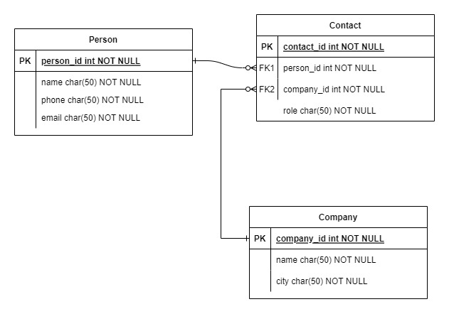

# ADDRESS BOOK


# Stack


# Summary

Este programa permite crear personas y empresas y relacionarlas entre si por medio de la clase contacto. Aca dejo un DER de la solucion.



# How to use this code?

1. Debe tener instalado [Java 11](https://www.java.com/download/)

2. Clonar este repositorio

```
$ git clone https://github.com/darwinmartinez86/ms-agenda
```

3. Posicionarse en la carpeta

```
$ cd ms-agenda/src
```

4. Compilar el proyecto

```
$ javac -d ../bin *.java
```

5. Ejecutar el proyecto

```
$ cd ../bin
$ java Main
```
Si todo a ido bien, se desplegara un menu donde podra interactuar con el programa

```
1. Agregar Persona
2. Agregar Empresa
3. Agregar Contacto
4. Buscar Persona por Nombre
5. Buscar Empresa por Nombre
6. Buscar Empresa por Ciudad
7. Buscar Empresa por Nombre en Ciudades
8. Buscar Contacto por Nombre de Persona
9. Buscar Contacto por Nombre de Empresa
10. Buscar Contacto por Ciudad
11. Buscar Contacto por Nombre de Empresa en Ciudades
12. Salir
Seleccione una opción: 
```

